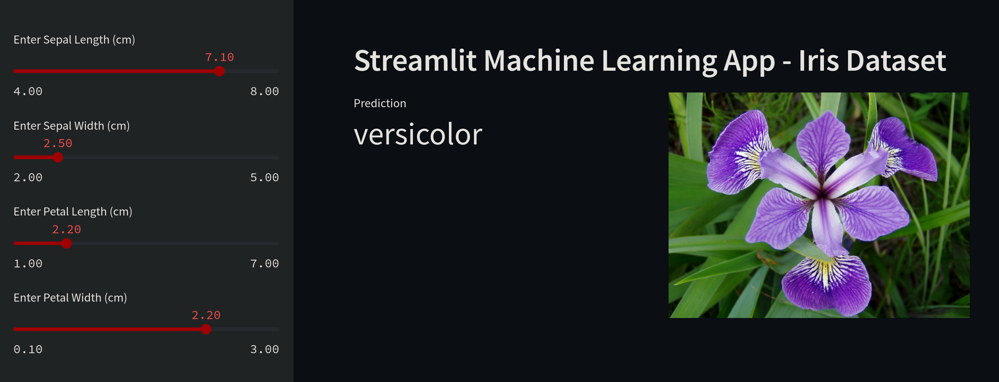

# ML Submission Project Documentation

This documentation provides an overview of the Machine Learning submission project created for a Master Class on AI. The project utilizes the Iris dataset and presents the results using Streamlit. Additionally, it is Dockerized for easy deployment and is hosted on an AWS EC2 instance.



## Project Overview

The main objective of this project is to demonstrate the application of Machine Learning techniques to a real-world dataset. The Iris dataset is a well-known dataset in the Machine Learning community, containing measurements of four features of three species of Iris flowers. The project includes the following key components:

1. **Iris Dataset**: The Iris dataset is used as the primary data source for this project. It consists of 150 samples, each belonging to one of three species of Iris flowers (setosa, versicolor, or virginica).

2. **Machine Learning Model**: A Machine Learning model is trained using the Iris dataset to classify the species of Iris flowers based on the provided features. The model's accuracy and performance are crucial for the success of the project.

3. **Streamlit Presentation**: Streamlit is used to create an interactive web application that showcases the project's results. This web app allows users to input feature values and see the predicted species for the given inputs.

4. **Dockerization**: The entire project is containerized using Docker for easy deployment and reproducibility. Docker ensures that the project can be run consistently across different environments.

5. **AWS EC2 Deployment**: The Dockerized project is deployed on an AWS EC2 (Elastic Compute Cloud) instance. This allows for the project to be accessible over the internet, making it available for demonstration and evaluation.

## Prerequisites

Before running the project, make sure you have the following prerequisites installed:

- Python (3.10 or higher)
- Docker
- AWS Account with an EC2 instance set up
- Required Python libraries (specified in the project's `requirements.txt` file)

## Project Structure

The project's directory structure is organized as follows:

```plaintext
ml-submission-project/
│
├── app.py             # Streamlit web application code
│
├── model.py           # Generates Trained Machine Learning model (serialized)
│
├── Dockerfile             # Docker configuration file
├── requirements.txt       # List of Python dependencies
├── README.md              # Project documentation (this file)
```

## Getting Started

Follow these steps to get the project up and running:

1. Clone the repository:

   ```bash
   git clone https://github.com/orkhank/master_class_cevap.git
   cd master_class_cevap
   ```

2. Build the Docker image:

   ```bash
   docker build -t streamlit .
   ```

3. Run the Docker container:

   ```bash
   docker run -p 8501:8501 streamlit
   ```

4. Access the Streamlit web application at `http://localhost:8501` to interact with the model and view the results.

## AWS EC2 Deployment

To deploy the project on an AWS EC2 instance, follow these general steps:

1. Create an AWS EC2 instance with Docker support.

2. Transfer the project files to the EC2 instance (e.g., using `scp` or by configuring AWS S3).

3. SSH into your EC2 instance.

4. Build and run the Docker container following the steps mentioned above.

5. Access the Streamlit web application using your EC2 instance's public IP or DNS and port 8501.

You can access the deployed app [here](51.20.44.211:8501). The connection is without domain and HTTPS.

